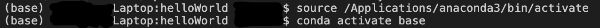
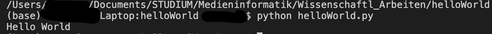

# helloWorld
This Repository let's you print "Hello World" in your console. 

## Getting Started

If you don't have python installed on your computer, download and install python from: `https://www.python.org/downloads/`.  
You can also use python on the Anacondoa Navigator.  

Now you can get your Hello-World running: 
You only have to navigate to the directory and type `python helloWorld.py`  
in your console to get the program running. 

Then in the console "Hello World" should be printed.  

Find out yourself!
